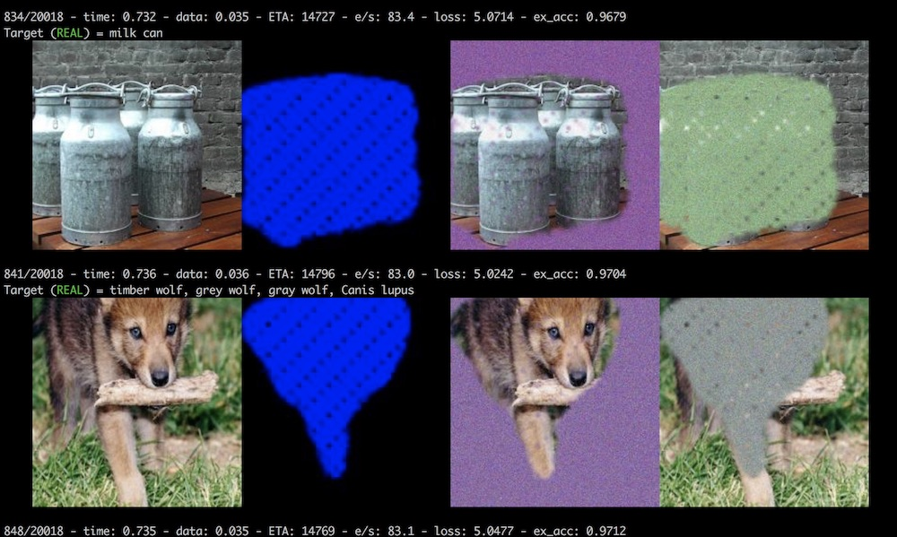

## Real-time image saliency
[[PAPER]](https://arxiv.org/abs/1705.07857)

#### Real-time saliency view
Run `python real_time_saliency.py` to perform the saliency detection on the video feed from your webcam. 
You can choose the class to visualise (1000 ImageNet classes) as well as the confidence level - low
confidence will highlight anything that resembles or is related to the target class, while higher confidence
will only show the most salient parts. 
  
 The model runs on a CPU by default and achieves about 5 frames per 
 second on my MacBook Pro (and over 150 frames per second on a GPU).

#### Training

Run `python saliency_train.py` to start the training. By default it will train the model to perform the saliency detection on the ImageNet dataset for the resnet50 classifier, but you can choose your own dataset/classifier combination. 
You will need PyTorch wich cuda support, the training will be performed on all your GPUs in parallel. I also advide to run the script from iTerm 2 terminal so that you can see the images during traning.  

#### Requirements

Other than usual dependencies (pytorch, numpy) you will also need:
 * [pycat](https://github.com/PiotrDabkowski/pycat) (to see the saliency images during training directly in the terminal)
   * `pip install pycat-real`
 * OpenCV (for real-time saliency view)
 * wxPython (for real-time saliency view)
   * `pip install -U wxPython`
   
   